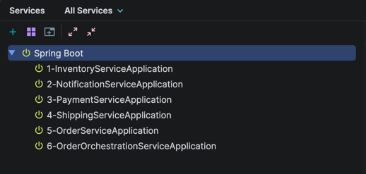

# Order Service Orchestration with Temporal, Spring boot and Kafka

### Prerequisites

- Java 25
- Gradle 9.1.0
- Docker Desktop

### Setup Instructions

1. Clone the repository:
   ```bash
   git clone
    ```
2. Navigate to the project directory.
3. Start Docker Desktop to ensure Docker containers can run.
4. Execute startup script to build the application and launch Temporal server and Kafka:
   ```bash
   chmod 775 ./startup.sh
   ./startup.sh
   ```
   Startup script performs the following tasks:
    - Builds and publishes Service Common
    - Builds and publishes Order Event Interface
    - Builds client sdk for Inventory Service
    - Publishes client sdk for Inventory Service
    - Builds client sdk for Notification Service
    - Publishes client sdk for Notification Service
    - Builds client sdk for Order Service
    - Publishes client sdk for Order Service
    - Builds client sdk for Payment Service
    - Publishes client sdk for Payment Service
    - Builds client sdk for Shipping Service
    - Publishes client sdk for Shipping Service
    - Starts docker containers for Temporal server and Kafka
5. Start the services in the following order:
    - Inventory Service
    - Notification Service
    - Payment Service
    - Shipping Service
    - Order Service
    - Order Management Orchestration Service
      

### Process Flow Diagram


